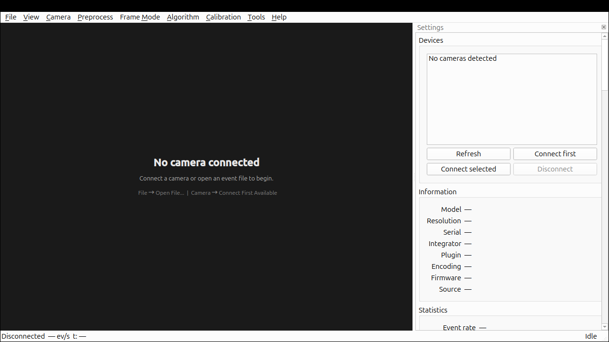
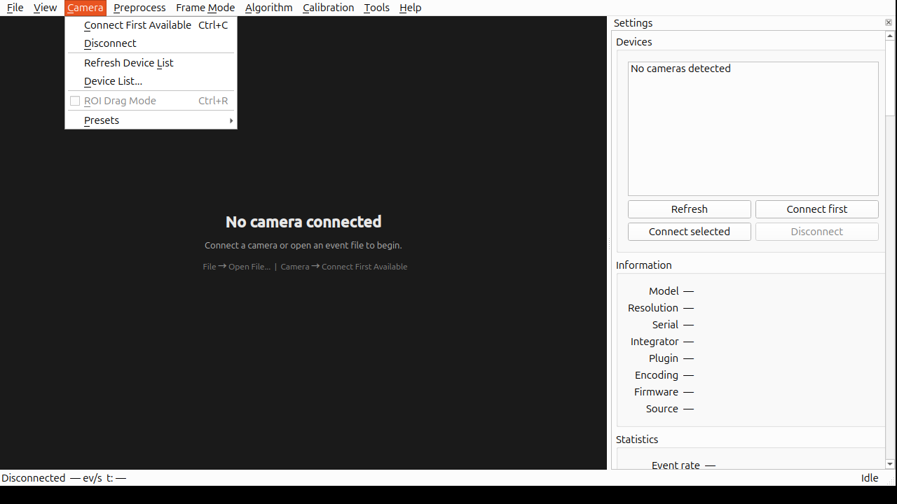
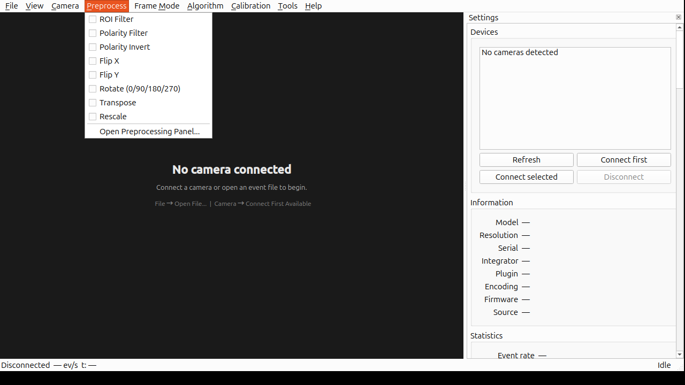
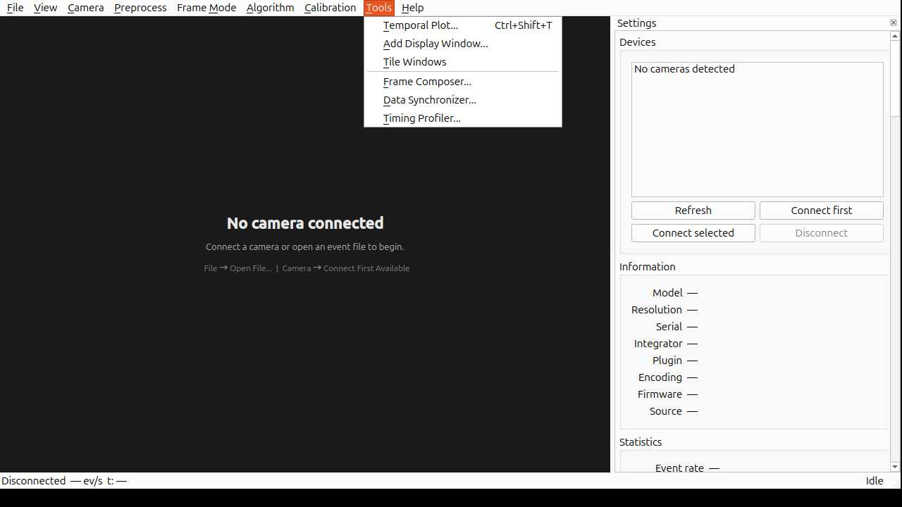

# GUI for openEB

A professional Qt 6 desktop application for [openEB](https://github.com/prophesee-ai/openeb) event cameras — real-time visualization, camera control, recording, playback, calibration, and data export, built on top of the open-source OpenEB SDK v5.2.0.

> **What is an event camera?** Unlike conventional frame-based cameras, event cameras (such as those from Prophesee/CenturyArks) output asynchronous per-pixel brightness changes — "events" — with microsecond temporal resolution, high dynamic range, and low power consumption. This application provides a complete desktop workflow for visualizing, recording, and processing these event streams.



---

## Table of Contents

- [Features](#features)
- [Quick Start](#quick-start)
- [Screenshots](#screenshots)
- [Directory Structure](#directory-structure)
- [Requirements](#requirements)
- [Building](#building)
- [Running](#running)
- [Camera Vendor Configuration](#camera-vendor-configuration)
- [Keyboard Shortcuts](#keyboard-shortcuts)
- [Development Roadmap](#development-roadmap)
- [License](#license)

---

## Features

### Real-time Event Display
- **OpenGL-accelerated rendering** (GLSL 3.30 core profile, letterboxed viewport)
- 7 frame modes: Diff, Integration, Histogram, Time Decay, Contrast Map, Periodic, On-Demand
- 4 colour palettes: Dark, Light, CoolWarm, Gray
- Adjustable accumulation time (1–1000 ms)
- Live statistics: event rate, peak rate, ON/OFF ratio, FPS, timestamp

### Camera Control Panels
- **Biases** — dynamic enumeration of all HAL biases with slider + spinbox + reset; save/load `.bias` files
- **ROI** — rectangle ROI/RONI via `I_ROI`; drag-to-select on the display widget; apply/clear
- **ESP** — Anti-Flicker (mode/band/preset/duty/threshold), Trail Filter (type/threshold), ERC (target event rate)
- **Trigger** — Trigger In (per-channel enable) + Trigger Out (enable/period/duty)

All panels gracefully degrade when the connected device lacks the corresponding HAL facility (e.g. file playback disables all four panels).

### Recording & Playback
- **RAW recording** from live cameras with real-time buffer flushing
- **File playback** with speed control, seek, pause/resume, and position tracking
- **File cutter** — extract a time range from an event file

### Data Export & Conversion
- Convert between RAW, HDF5, and CSV formats
- Export event data to AVI video (via CDFrameGenerator + CvVideoRecorder)
- Configurable FPS, accumulation time, quality, and colour mode

### Event Preprocessing
- 8-stage filter chain: ROI Filter, Polarity Filter, Polarity Invert, Flip X, Flip Y, Rotate, Transpose, Rescale
- Toggle individual stages from the menu bar or the Preprocessing panel
- Thread-safe filter chain with mutex protection

### Calibration
- **Intrinsic calibration wizard** — chessboard pattern capture, corner detection, parameter optimization
- **Extrinsic calibration wizard** — multi-camera extrinsic estimation
- Step-by-step guided workflow with live preview

### Multi-Window & Layout
- **Temporal Plot** — X-T / Y-T scatter plot of event coordinates vs. time
- **Multi-display windows** — spawn additional OpenGL viewports in an MDI area
- **Layout save/restore** — persist dock geometry and window positions to JSON

### Algorithm Bridge
- Full 46-algorithm metadata registry (noise filter, optical flow, blob detection, object tracking, corner detection, stereo matching, etc.)
- Runtime parameter persistence (save/load to JSON)
- Thread-safe algorithm instance management

---

## Quick Start

```bash
# 1. Clone the repository (openEB SDK is included as a subtree)
git clone <repo-url> GUI-for-openEB
cd GUI-for-openEB

# 2. Build
cmake -B build -DCMAKE_BUILD_TYPE=Release
cmake --build build -- -j$(nproc)

# 3. Run (the launcher script sets all required env vars)
./scripts/run_gui.sh
```

That's it. The launcher script auto-detects Wayland sessions, sets the correct Qt platform plugin, and configures the HAL plugin path.

---

## Screenshots

### Main Window


### Camera Menu



### Preprocess Menu



### Tools Menu



---

## Directory Structure

```
GUI-for-openEB/
├── openeb/                       # openEB SDK subtree (Apache 2.0, v5.2.0)
├── gui/                          # GUI application (C++17 / Qt 6)
│   ├── main.cpp                  # Application entry, env-var defaults
│   ├── main_window.{h,cpp}       # Main window: menus, docks, signal wiring
│   ├── display/                  # OpenGL event display widget
│   ├── panels/                   # Settings dock panels
│   │   ├── devices_panel.*       # Camera discovery & connection
│   │   ├── information_panel.*   # Sensor metadata
│   │   ├── statistics_panel.*    # Event rate / ON-OFF / FPS
│   │   ├── display_panel.*       # Frame mode, palette, accumulation
│   │   ├── biases_panel.*        # LL-bias control
│   │   ├── roi_panel.*           # Region of Interest
│   │   ├── esp_panel.*           # Anti-Flicker / Trail / ERC
│   │   ├── trigger_panel.*       # Trigger In / Out
│   │   ├── preprocessing_panel.* # 8-stage filter chain
│   │   ├── algorithms_panel.*    # Algorithm registry
│   │   ├── file_tools_panel.*    # Convert / cut / info
│   │   └── settings_panel.*      # Tabbed container
│   ├── app/                      # Controllers
│   │   ├── camera_controller.*   # Camera lifecycle & HAL facility access
│   │   ├── frame_pipeline.*      # CD → QImage rendering pipeline
│   │   ├── statistics_controller.*  # Event rate calculation
│   │   └── file_converter.*      # Background file conversion
│   ├── algo_bridge/              # Algorithm registry & filter chain
│   ├── recorder/                 # RAW recording & file playback
│   ├── exporter/                 # HDF5/CSV/AVI export
│   ├── config/                   # JSON config & layout persistence
│   ├── calibration/              # Intrinsic/extrinsic wizard
│   ├── temporal/                 # X-T / Y-T temporal plot
│   ├── widgets/                  # Multi-window MDI manager
│   └── CMakeLists.txt
├── algo/                         # Self-developed algorithm library
│   ├── common/                   # Event buffer, frame generator, data loader
│   ├── calibration/              # Intrinsic & extrinsic algorithms
│   └── CMakeLists.txt
├── scripts/
│   └── run_gui.sh                # Launcher script (env-var setup)
├── pic/                          # Screenshots for README
├── doc/
│   ├── design.md                 # Full design specification (10-phase plan)
│   └── compile.md                # Build guide (Ubuntu 26.04 / GCC 15)
├── LICENSE                       # MIT (project's original code)
├── README.md                     # English documentation
└── README_CN.md                  # Chinese documentation
```

---

## Requirements

| Component | Version |
|-----------|---------|
| OS | Ubuntu 26.04 (or compatible Linux) |
| Compiler | GCC 15+ |
| CMake | 4.x |
| Qt | 6.x (Widgets, OpenGL, OpenGLWidgets) |
| OpenEB SDK | 5.2.0 (included as subtree) |
| OpenCV | 4.x |
| Python | 3.12 (only if building openEB from source) |

See [doc/compile.md](doc/compile.md) for detailed OS setup, including the GCC 15 `<cstdint>` fix and Python 3.12 via deadsnakes PPA.

---

## Building

```bash
# 1. Ensure openEB SDK is installed (see doc/compile.md)
# 2. Configure
cmake -B build -DCMAKE_BUILD_TYPE=Release

# 3. Build
cmake --build build -- -j$(nproc)
```

The binary is output to `build/gui/gui_for_openeb`.

---

## Running

### Option 1: Launcher Script (Recommended)

```bash
./scripts/run_gui.sh
```

The script automatically:
- Sets `LD_LIBRARY_PATH` to include `/usr/local/lib`
- Sets `HDF5_PLUGIN_PATH` for HDF5 file support
- Sets `MV_HAL_PLUGIN_PATH` to the Prophesee default (override for other vendors)
- Forces `QT_QPA_PLATFORM=xcb` on Wayland sessions (the Wayland plugin renders a black viewport for `QOpenGLWidget`)
- Forces `QSG_RHI_BACKEND=opengl` (Qt 6 may default to Vulkan, causing a black screen)

To customise for your camera, copy the script and edit the env vars:

```bash
cp scripts/run_gui.sh scripts/run_gui.local.sh
# Edit scripts/run_gui.local.sh — change MV_HAL_PLUGIN_PATH, etc.
./scripts/run_gui.local.sh
```

### Option 2: Manual Launch

```bash
# Required env vars
export LD_LIBRARY_PATH="${LD_LIBRARY_PATH:-}:/usr/local/lib"
export HDF5_PLUGIN_PATH="${HDF5_PLUGIN_PATH:-}:/usr/local/lib/hdf5/plugin"
export MV_HAL_PLUGIN_PATH=/usr/local/lib/metavision/hal/plugins  # Prophesee
# export MV_HAL_PLUGIN_PATH=/usr/lib/CenturyArks/hal/plugins     # CenturyArks

# Wayland fix: force XCB plugin (the Wayland plugin renders black for QOpenGLWidget)
export QT_QPA_PLATFORM=xcb
# Force OpenGL RHI backend (Qt 6 may default to Vulkan, causing black screen)
export QSG_RHI_BACKEND=opengl

./build/gui/gui_for_openeb
```

### Environment Variables

| Variable | Purpose | Default |
|----------|---------|---------|
| `MV_HAL_PLUGIN_PATH` | Camera HAL plugin directory | `/usr/local/lib/metavision/hal/plugins` |
| `HDF5_PLUGIN_PATH` | HDF5 plugin directory (for `.hdf5` files) | `/usr/local/lib/hdf5/plugin` |
| `LD_LIBRARY_PATH` | SDK shared library search path | must include `/usr/local/lib` |
| `QT_QPA_PLATFORM` | Qt platform plugin | `xcb` on Wayland; unset otherwise |
| `QSG_RHI_BACKEND` | Qt RHI backend | `opengl` |

> **Wayland note**: On Wayland sessions, Qt 6's Wayland plugin renders a black viewport for `QOpenGLWidget` children. The application and launcher script automatically force `QT_QPA_PLATFORM=xcb` (via XWayland) and `QSG_RHI_BACKEND=opengl` to ensure correct rendering. If you use the binary directly without the launcher, make sure to set these variables.

---

## Camera Vendor Configuration

The `MV_HAL_PLUGIN_PATH` must point to your camera vendor's HAL plugin directory:

| Vendor | Plugin path |
|--------|-------------|
| Prophesee (default openEB) | `/usr/local/lib/metavision/hal/plugins` |
| CenturyArks | `/usr/lib/CenturyArks/hal/plugins` |

If the env var is already exported in your shell, the application respects it; otherwise it falls back to the Prophesee default.

To verify that your camera is detected:

```bash
# List online cameras via the openEB SDK
metavision_hal_ls
```

---

## Troubleshooting

### Black screen / blank viewport on startup

This is a Wayland + Qt 6 rendering issue. The launcher script (`scripts/run_gui.sh`) handles it automatically, but if you launch the binary directly:

```bash
export QT_QPA_PLATFORM=xcb        # Force XCB via XWayland
export QSG_RHI_BACKEND=opengl     # Force OpenGL (Qt 6 may default to Vulkan)
```

### Camera not detected

1. Verify the HAL plugin path matches your vendor (see [Camera Vendor Configuration](#camera-vendor-configuration)).
2. Check `metavision_hal_ls` output — if it fails, the SDK cannot find the plugins.
3. Ensure `LD_LIBRARY_PATH` includes `/usr/local/lib`.
4. For CenturyArks cameras, the plugin `libsilky_common_plugin.so` must be present in the plugin directory.

### "No camera connected" even though `metavision_hal_ls` works

The GUI auto-detects the plugin path on startup. If your vendor path differs from the Prophesee default, set `MV_HAL_PLUGIN_PATH` before launching:

```bash
export MV_HAL_PLUGIN_PATH=/usr/lib/CenturyArks/hal/plugins
./scripts/run_gui.sh
```

### Build fails with missing `<cstdint>` (GCC 15)

GCC 15 changed the default standard. Apply the fix documented in [doc/compile.md](doc/compile.md).

### HDF5 files fail to open

Set `HDF5_PLUGIN_PATH` to the HDF5 plugin directory (typically `/usr/local/lib/hdf5/plugin`).

---

## Keyboard Shortcuts

| Shortcut | Action |
|----------|--------|
| `Ctrl+O` | Open event file |
| `Ctrl+C` | Connect first available camera |
| `Ctrl+R` | Toggle ROI drag mode |
| `R` | Start recording |
| `F11` | Fullscreen |
| `Ctrl+Shift+T` | Open Temporal Plot |
| `Ctrl+Q` | Quit |

---

## Development Roadmap

Based on [doc/design.md](doc/design.md) (10-phase plan):

| Phase | Description | Status |
|-------|-------------|--------|
| 1 | CMake skeleton, camera discovery, OpenGL display, basic params, stats panel, algo_bridge skeleton | **Done** |
| 2 | Bias / ROI / ESP / Trigger control panels | **Done** |
| 3 | Recording, playback, file cutter | **Done** |
| 4 | Export / convert (RAW ↔ HDF5 ↔ CSV, AVI export) | **Done** |
| 5 | Event filter chain + 8 preprocessors | **Done** |
| 6 | Self-developed CV algorithms (noise filter, optical flow, blob, tracker, …) | Skipped |
| 7 | Analytics algorithms (active marker, event-to-video) | Skipped |
| 8 | Calibration algorithms (intrinsic/extrinsic) | Skipped |
| 9 | Calibration wizard UI (intrinsic/extrinsic) | **Done** |
| 10 | Multi-window layout, temporal plot, layout persistence, i18n | **Done** |

> Phases 6–8 (self-developed CV/analytics/calibration algorithms) are skipped in this build. The algorithm registry and bridge interface are in place; implementations can be added in future sessions.

---

## License

### Original code of this project

Licensed under the [MIT License](LICENSE).

### Referenced openEB code

This project references [openEB](https://github.com/prophesee-ai/openeb) (version 5.2.0).

openEB is licensed under the [Apache License 2.0](openeb/licensing/LICENSE_OPEN), with copyright held by Prophesee and its contributors. Any use, modification, or distribution of the openEB code must comply with the terms of the Apache License 2.0.

Third-party open source notices for openEB can be found at [OPEN_SOURCE_3RDPARTY_NOTICES](openeb/licensing/OPEN_SOURCE_3RDPARTY_NOTICES).
